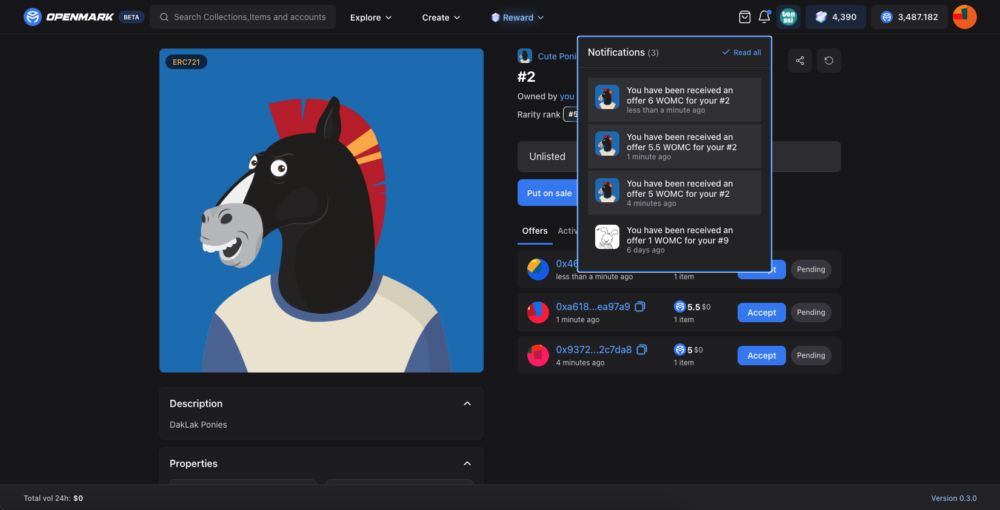

# How to Make & Accept Offers on OpenMark?

<figure><figcaption></figcaption></figure>

### **Making an Offer**

1. Click on the NFT you're interested in.
2. Hit **"Make Offer"** and enter your bid.
3. Confirm the transaction, and your offer is placed!

🔹 Offers only work with **ERC-721** tokens.\
🔹 You may need to **approve the token** for OpenMark contract.\
🔹 If using a native token, you might need to **wrap it** before placing an offer. Learn more about wrapped tokens [here](https://wiki.openmark.io/about-openmark/knowlegde/what-is-wrap-token).

### **Accepting an Offer**

1. Go to your NFT listing.
2. Review incoming offers.
3. Click **"Accept Offer"** and confirm the transaction.

**NOTE:** Remember to check your notifications! 🔔 The notification bell in the top menu bar will alert you when you receive a new offer or when one of your offers is accepted.

