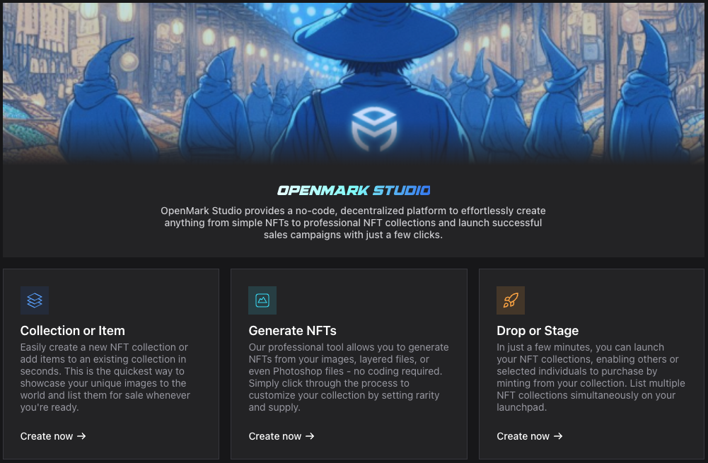

# How to Use OpenMark Studio?

<figure><figcaption></figcaption></figure>

### **From Scratch to Launch: The 3-Step Process**

**1. Generate Your NFT Collection**

Use the **NFT Generation Tool** to easily create a professional NFT collection with just a few clicks.

**2. Deploy Your Collection on the Blockchain**

Deploy your collection on the blockchain using one of the three most popular standards:

* **ERC-721** (Standard NFTs)
* **ERC-1155** (Multi-token standard)
* **DN-404** (Hybrid ERC-20 & ERC-721 standard)

**3. Launch Your NFT Collection**

Instantly launch your collection using **Open Launchpad.**
